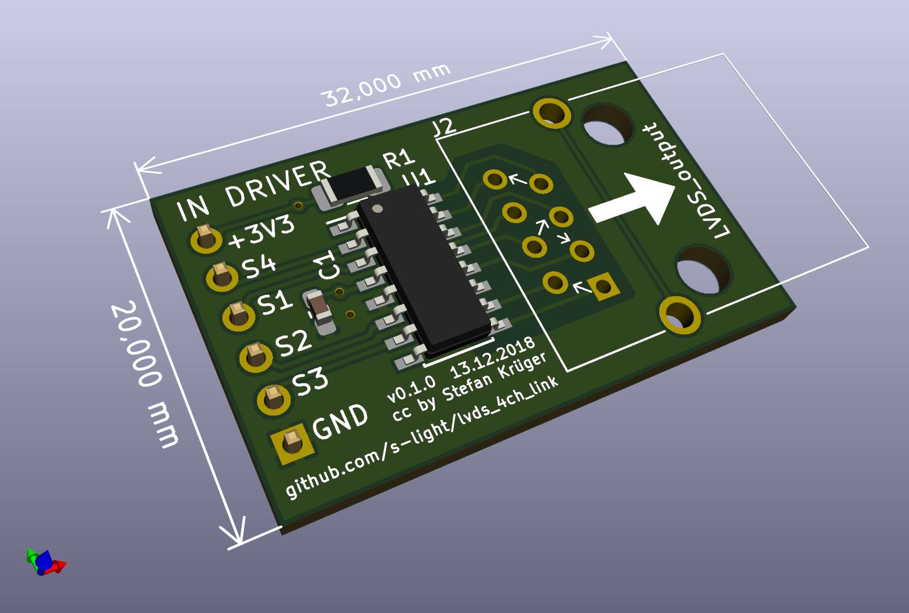
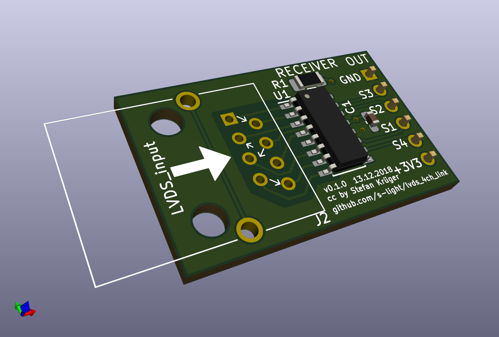
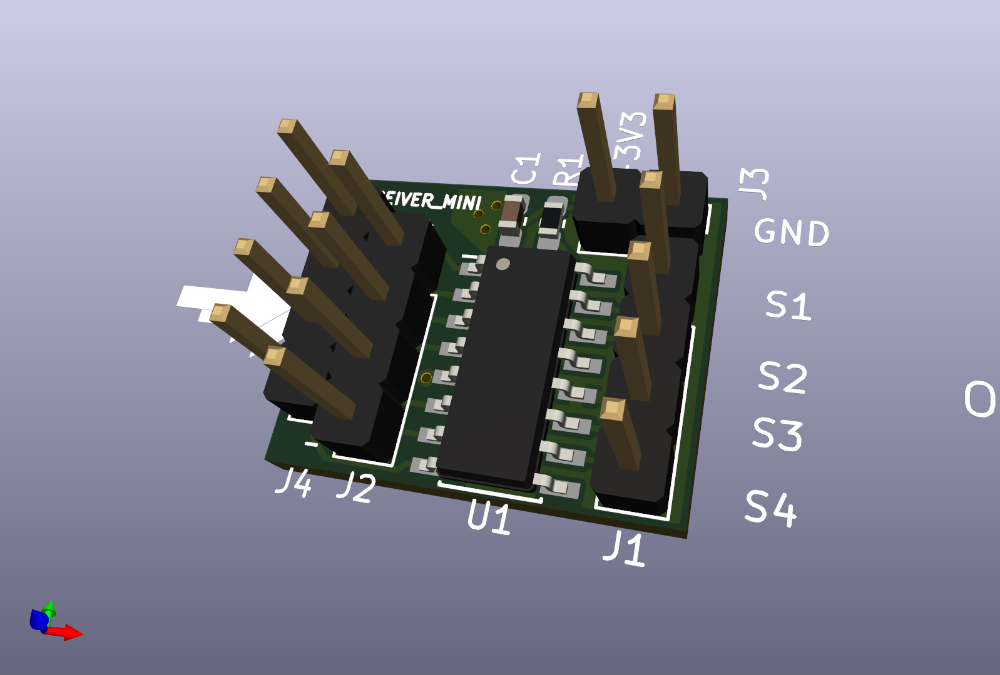
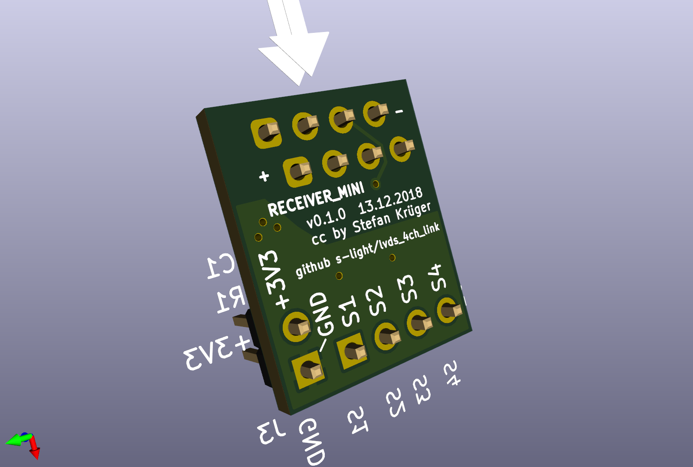

<!--lint disable list-item-indent-->
<!--lint disable list-item-bullet-indent-->

# lvds_4ch_link
Simple LVDS 4ch Link over network-patch-cable

can be used for SPI, UART or simple GPIO

- Receiver: TI [SN65LVDT348](http://www.ti.com/product/SN65LVDT348)
- Driver: TI [SN65LVDS391](http://www.ti.com/product/SN65LVDS391)

---

# License
<!-- license info -->

 

    lvds_4ch_link
 by
<a xmlns:cc="http://creativecommons.org/ns#"
        href="https://github.com/s-light/lvds_4ch_link/"
        property="cc:attributionName"
        rel="cc:attributionURL">
    Stefan Krüger (s-light)
</a>
is licensed under a 
<a rel="license" href="http://creativecommons.org/licenses/by/4.0/">
    Creative Commons Attribution 4.0 International License
</a>.
<!-- license info end -->
